# DIO - Trilha .NET - Banco de Dados
www.dio.me

## Desafio de projeto
Para este desafio, você precisará usar seus conhecimentos adquiridos no módulo de banco de dados, da trilha .NET da DIO.

## Contexto
Você é responsável pelo banco de dados de um site de filmes, onde são armazenados dados sobre os filmes e seus atores. Sendo assim, foi solicitado para que você realize uma consulta no banco de dados com o objetivo de trazer alguns dados para análises.

## Proposta
Você precisará realizar 12 consultas ao banco de dados, cada uma retornando um tipo de informação.

## 1 - Buscar o nome e ano dos filmes

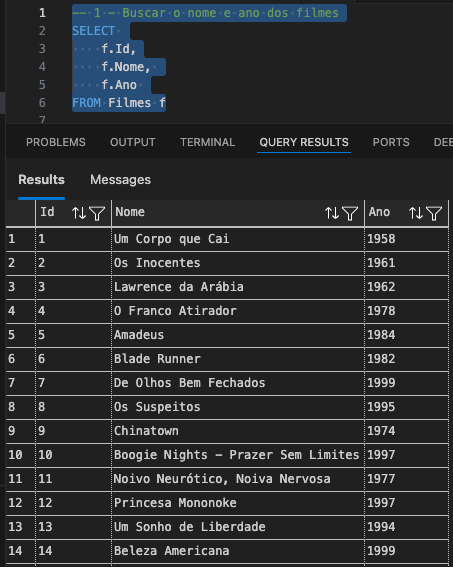

## 2 - Buscar o nome e ano dos filmes, ordenados por ordem crescente pelo ano

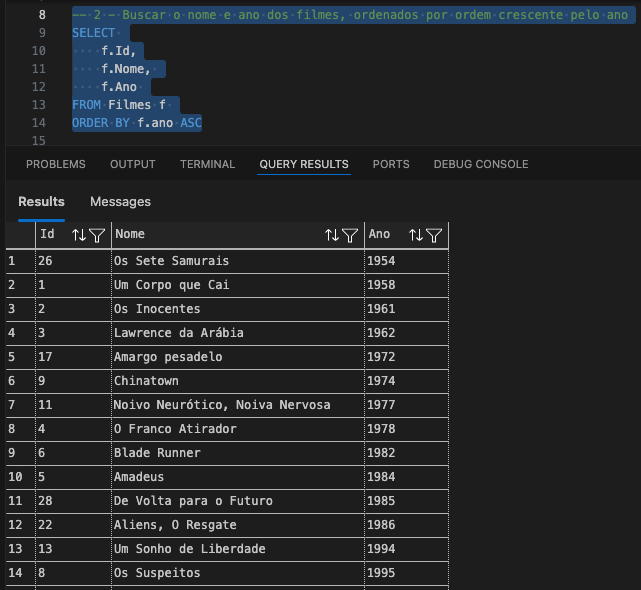

## 3 - Buscar pelo filme de volta para o futuro, trazendo o nome, ano e a duração

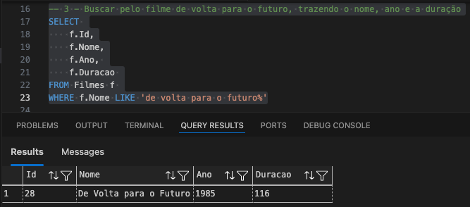

## 4 - Buscar os filmes lançados em 1997

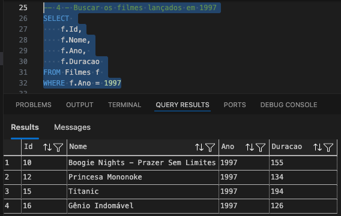

## 5 - Buscar os filmes lançados APÓS o ano 2000

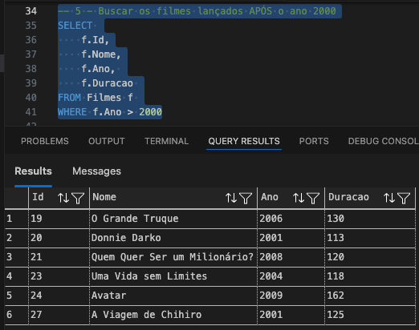

## 6 - Buscar os filmes com a duracao maior que 100 e menor que 150, ordenando pela duracao em ordem crescente

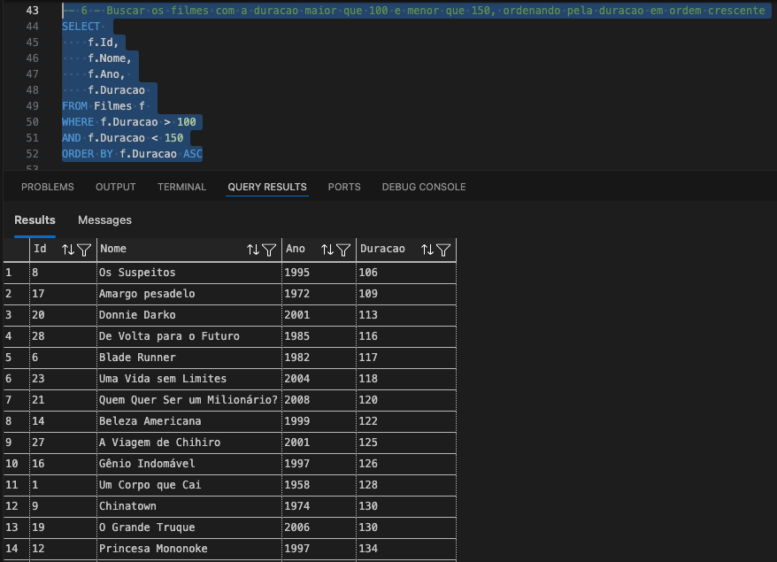

## 7 - Buscar a quantidade de filmes lançadas no ano, agrupando por ano, ordenando pela duracao em ordem decrescente

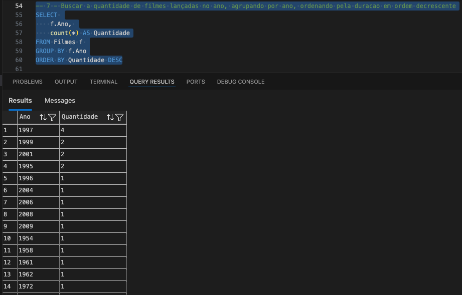

## 8 - Buscar os Atores do gênero masculino, retornando o PrimeiroNome, UltimoNome

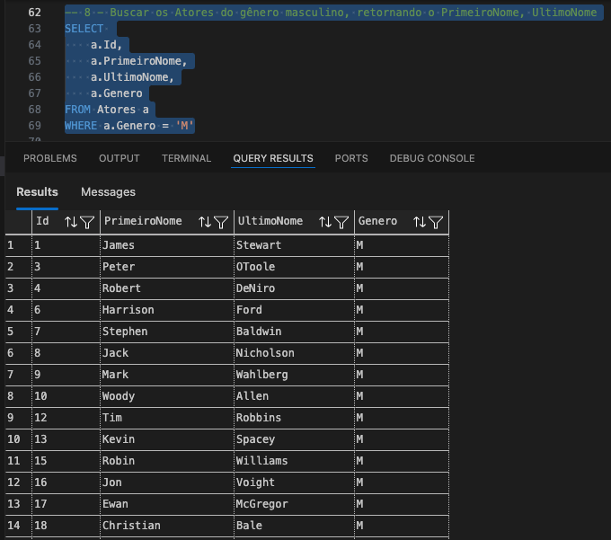

## 9 - Buscar os Atores do gênero feminino, retornando o PrimeiroNome, UltimoNome, e ordenando pelo PrimeiroNome

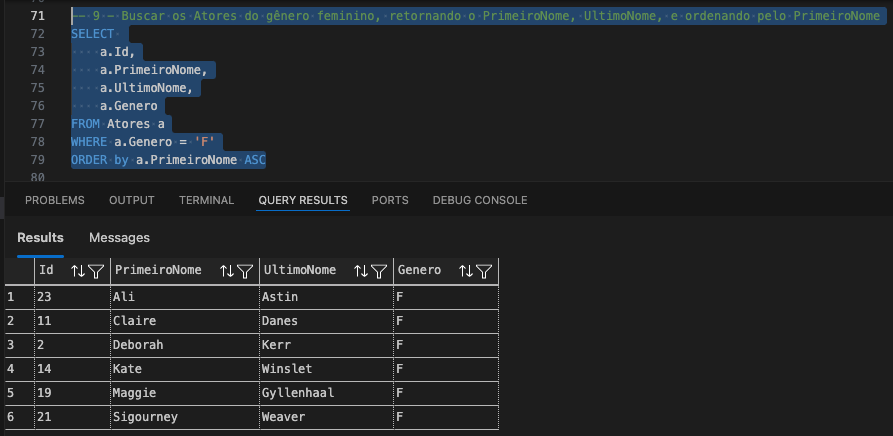

## 10 - Buscar o nome do filme e o gênero

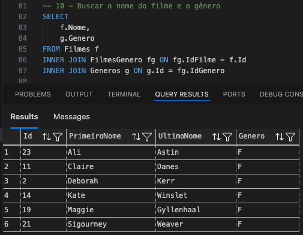

## 11 - Buscar o nome do filme e o gênero do tipo "Mistério"

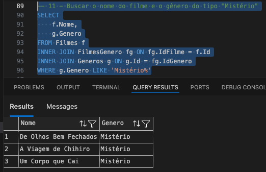

## 12 - Buscar o nome do filme e os atores, trazendo o PrimeiroNome, UltimoNome e seu Papel

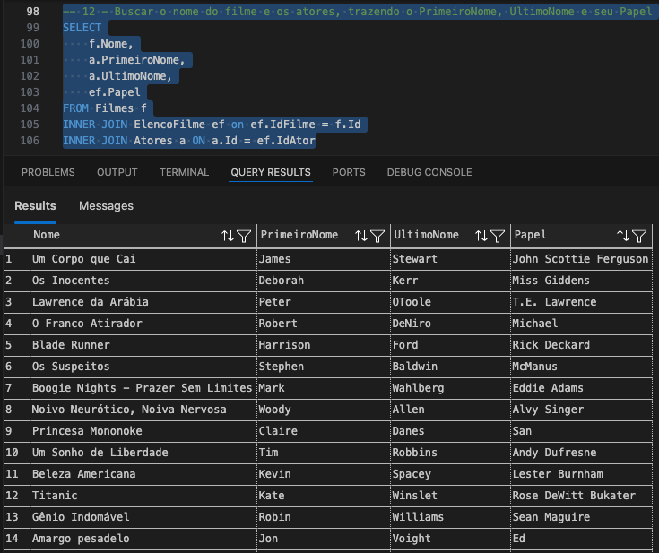